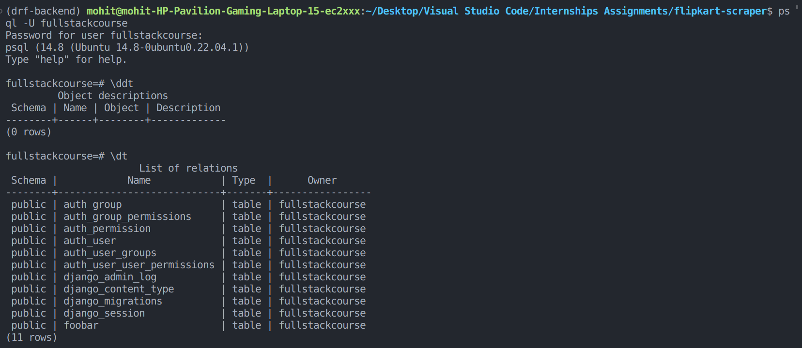

## Installing Postgresql on Linux
```
sudo apt update

sudo apt install postgresql postgresql-contrib
```


postgresql uses a proces 
**ident authentication** on macOS and ubuntu . 
when you attempt to login to postgresql console then postgresql looks for a user with name equal to your linux username , if found then looks for a database with that same name to connect.

! There are better ways so we will using those .


> when you install postgresql along with that it also creates a default postgresql user name postgres in order to interact with postgresql. so we will use that user to login in the console.

```
sudo -i -u postgres
```


## Creating new linux user for connecting with postgresql console

* open any usual terminal and type the command :

```
sudo adduser fullstackcourse (fill the further details asked)
```
> password : *Mohit123**  for fullstackcourse 
* Now login with that user name in your linux shell

```
sudo -i -u fullstackcourse
```

* User fullstackcourse user in postgresql
```
psql -U fullstackcourse
```

* some commands
```
\c to check connection
\q to quit
\conninfo to know more info about connection like port no.
\du to know about the users.
\s to get command history.
\l to know databases.
\c postgres to connect to other databases here 'postgres'
\g to run the previous command again.
\dt to get all tables.

SELECT version to know about postgresql version
```

> \? to know about further commands .

* Creating a database
```
CREATE DATABASE database_name 
or
CREATE DATABASE database_name WITH OWNER user_name
```

<div style="color:red; margin-bottom:4px" > Always use a semicolon  to send a command. </div>

* CHANGING PASSWORD OF A USER IN POSTGRESQL SHELL
```
ALTER USER fullstackcourse WITH PASSWORD 'fullstackcourse'
```


* Deleting a database
```
DROP DATABASE db_name
or 

DROP DATABASE IF EXISTS db_name
```

* Renaming a database
```
ALTER DATABASE testing RENAME TO testing2;
```

* Changing the owner of Database
```
ALTER DATABASE testing OWNER TO owner_name; 
```

* creating table
```
CREATE TABLE IF NOT EXISTS foobar (id SERIAL PRIMARY KEY);
```

* dropping a table that you own
```
DROP TABLE table_name
or 
DROP TABLE IF EXISTS table_name
```

* Getting Table Schema
```
\d table_name
```

* Auto generating id for each unique row
```
CREATE TABLE table_name (id INT ALWAYS AS IDENTITY , PRIMARY KEY(id));
```


* CREATING TABLE EXAMPLE
```
CREATE TABLE car (id INT GENERATED ALWAYS AS IDENTITY ,owner_id INT,PRIMARY KEY (id),CONSTRAINT fk_owner FOREIGN KEY (owner_id) REFERENCES owner(id));
```

CONSTRAINT fk_owner FOREIGN KEY (owner_id) REFERENCES owner(id): This section adds a foreign key constraint to the car table:

* CONSTRAINT fk_owner: This names the foreign key constraint.

* FOREIGN KEY (owner_id): This specifies that the owner_id column in the car table is a foreign key.

* REFERENCES owner(id): This indicates that the foreign key references the id column of a table named owner.


### commands for postgresql configure
```
1. sudo systemctl status postgresql (to check status)
2. sudo systemctl start postgresql (to start postgresql server)
3. sudo systemctl stop postgresql  (to stop)
```
* for opening postgresq.conf
```
sudo vim /etc/postgresql/14/main/postgresql.conf
```

* for open pg_hba.conf
```
sudo vim /etc/postgresql/14/main/pg_hba.conf
```


## MIGRATIONS 
Migrations in Django are a way to manage changes to your database schema over time. They are automatic scripts that help you create, update, or delete database tables and fields, ensuring your database structure matches your code. Migrations help you avoid manual database adjustments, making it easier to track and apply changes as your app evolves.


Intially you do have some unapplied migrations that come along with your django setup but it's always a good practice to make the migrations first and then apply them for that you can follow the commands : 
```
python manage.py makemigrations

python manage.py migrate
```
> the above commands will create the django tables in the database that is configured in the default database settings.




continue from 25.00 ....