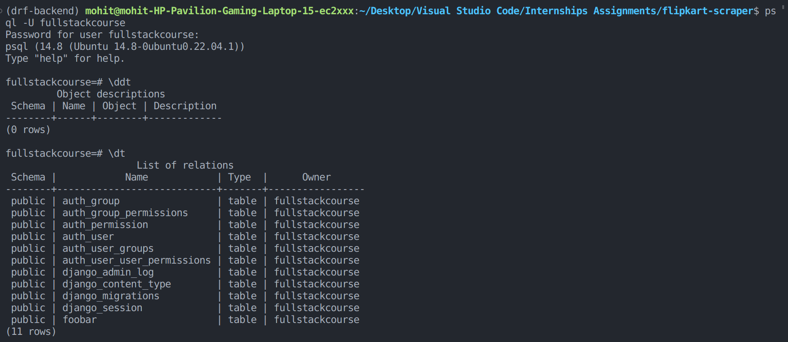
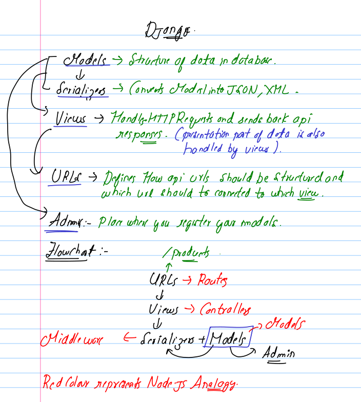

# Steps to setup your django development environment

1. **Install Virtual Environment**:
   It's a good practice to create a virtual environment for your Django projects. Virtual environments isolate your project's dependencies from the system-wide Python installation, making it easier to manage dependencies for different projects.

- INSTALLING PYENV

> pyenv is a popular open-source tool that allows you to easily manage multiple versions of Python on your system. It provides a simple and convenient way to install, switch between, and manage different Python versions within isolated environments. This is particularly useful for developers who work on projects that require specific versions of Python or need to avoid conflicts between different Python applications.

```
https://realpython.com/intro-to-pyenv/#build-dependencies
```

2. Create your virtual environment and activate

```
1. pyenv virtualenv environment_name
2. pyenv actiate environment_name
3. pyenv deactivate en
```

> here virtual environments are nothing but python versions only it is just that they are created for isolated development of python projects and locally saved on your system just like any other python version that is installed on your system. It is like npm for python but has extended workload to the managment of several other python versions. you can check that our using the command :

```
pyenv versions
```

<div style="color:red">Always Ensure that you have activated your virtual environment.</div>
</br>

## Installing Django

```
pip install django

pip install black (code formattor)

django-admin startproject backend . (to create files)

python manage.py runserver (to run server)
```

> sometimes your code editor may not be able to connect your django files to your system file so it is always a good practice to select interpreter by pressing F1 and selecting corresponding interpreter.

## Setup PostgreSQL Database Adapter

It provides an interface for connecting to PostgreSQL databases, executing SQL queries, and managing data.
It provides a level of abstraction that converts your python code in sql commands so that you yourself don't have to do that on your own .

```
pip install psycopg2
```

### now configure the database connection in settings.py

```
DATABASES = {
    "default": {
        "ENGINE": "django.db.backends.postgresql_psycopg2",
        "NAME":"fullstackcourse",
        "USER":"fullstackcourse",
        "PASSWORD":"fullstackcourse",
        "HOST":"localhost",
        "PORT":"5432",
    }
}
```

## Setting up Django Rest framework

Django is a complete solution to do a lot of stuff like creating web apis, providing services, full web apps etc.
But for dealing with pure apis , we can use this framework for easyness rather than writing in pure django framework.It is specifcally dedicated to use django for creating web Apis.

```
https://www.django-rest-framework.org/#installation
```

> don't forget to add rest_framework thing in Installed_apps in settings.py

```
INSTALLED_APPS = [
    "django.contrib.admin",
    "django.contrib.auth",
    "django.contrib.contenttypes",
    "django.contrib.sessions",
    "django.contrib.messages",
    "django.contrib.staticfiles",
    'rest_framework',
]
```

> Inside URLs.py

```

urlpatterns = [
    path("admin/", admin.site.urls),
    path("auth/", include("rest_framework.urls")),
]
```

- go to http://localhost:auth/login to see the login form.

## Create a Super User

In Django, a superuser is a user account with special privileges that allow them to access and manage the Django admin interface, which is a web-based tool for managing the application's data and settings. Superusers have the highest level of access and control within the Django project.

Tasks of a Super user :

1. Accessing the Admin Interface.
2. Managing Models.
3. Managing Users and groups.
4. Customizing Site Settings.
5. Running Management Commands.

```
python manage.py createsuperuser
```

## Django Applications

Applications are a way we add modularity to our codebase that is managing logic of sepearate fields seperately like we used to create products.js in route folders in express to handle all the routes related to products, it is similar to that only.

```
django-admin startapp products (products here is application name)
```

Now django itself do not understand what products is so we need to configure our settings.py to tell django about products.

```
INSTALLED_APPS = [
    ...,
    "products.apps.ProductsConfig",
]
```

## MIGRATIONS 
Migrations in Django are a way to manage changes to your database schema over time. They are automatic scripts that help you create, update, or delete database tables and fields, ensuring your database structure matches your code. Migrations help you avoid manual database adjustments, making it easier to track and apply changes as your app evolves.


Intially you do have some unapplied migrations that come along with your django setup but it's always a good practice to make the migrations first and then apply them for that you can follow the commands : 
```
python manage.py makemigrations

python manage.py migrate
```
> the above commands will create the django tables in the database that is configured in the default database settings.



## Maintaining database maintenances

1. Create a folder name db-backups

2. dump your postgresql data into that db_backups folder using the following command :

```
pg_dump -F t fullstackcourse > db-backups/fullstackcourse-1.taclr
```

## Creating Data Models

In Django, a data model refers to a Python class that defines the structure and behavior of a database table. Data models in Django are used to define the schema of the database, including the fields and relationships that the table will have. These models act as a bridge between the database and the Python code, allowing you to interact with the database using high-level Python objects.

## Serializers

Serializers allow you to convert complex data types (such as Django model instances) into native Python data types that can be easily rendered into JSON, XML, or other content types. They also provide the ability to deserialize the data received from clients into complex types, after first validating the incoming data.

They will with data models to output data to **views** which further help us in displaying data to our final end users using api calls.

## Managers
In Django, a manager is an essential part of the Object-Relational Mapping (ORM) system that allows you to interact with the database using Python code instead of writing raw SQL queries. Managers provide an interface for querying, creating, updating, and deleting records in the database through the associated model.


# Django Flow 


## Changing pyenv environment to .venv environment (making vs code handle our virtual environment)

pyenv is great but not optimal enough to manage our python versions so we will use vs code inbuild functions for creating virtual environments using .venv .

```
1. reserver the python dependencies.

2. delete the environment
    pyenv virtualenv-delete environment_name

3. do ls -l and remove that file

4. open vs code finder F1 and enter create environment

5. Do the next you will be able to do that part.

6. now if you have missed the first step then you have to reinstall all the dependencies.
```

## restarting your virtual environment
```
cd project 

source .venv/bin/activate
```
> to stop your virtual environment simply write **deactivate**

## Nuking your Database
Sometimes, during development or complex changes to your models, migrations can become inconsistent or broken. This can happen when migrations reference tables or fields that no longer exist or have been renamed. Attempting to fix these issues manually can be time-consuming and error-prone, so starting fresh can be a quicker solution.

1. Delete your existing database .
```
DROP DATABASE db_name (from another database)
```
2. Delete your migrations folders of all of your applications. 
3. Recrete the database (with same name) and migrations/__init__.py thing.

4. python manage.py makemigrations

5. python manage.py migrate

> this will delete all of your database content as well informations about your users and superusers so you have to recrate them as well. 

